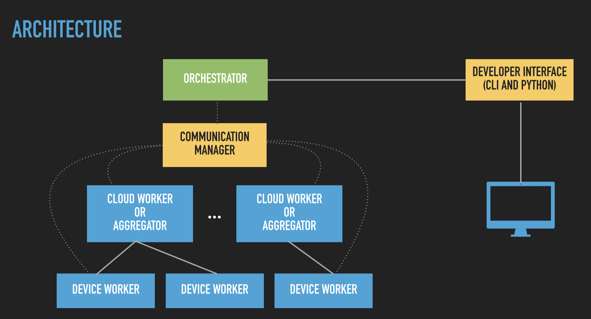

- [FL Deployment](#fl-deployment)
  - [Orchestrator](#orchestrator)
  - [Plan Serialization](#plan-serialization)
  - [Setting FL hyper parameters](#setting-fl-hyper-parameters)
  - [Connecting to Orchestrator](#connecting-to-orchestrator)
  - [Hosting the models](#hosting-the-models)
- [On-device Training](#on-device-training)

# FL Deployment 
With the simulations done and benchmark results satisfactory, you may want to take things into production.

The best thing about using NimbleEdge simulator is it already checks for compatibility and serialization capabilties of the models.

Let's see the components needed to deploy the FL cycle.



## Orchestrator
You can control the orchestrator via CLI or by python commands. NimbleEdge Orchestrator is built over [PySyft](https://github.com/OpenMined/PySyft/tree/dev/packages/grid)

The service itself can be run as a docker container on the main server.

create a virtual environment to install the necessary dependecies. The dependencies could simply be installed via 

```bash
poetry install
```

Now the start the orchestrator in a docker container with 

```bash
docker-compose up -d
```

## Plan Serialization
We can serializes any torch computation graph into a plan for local execution. The simulator does this automatically for you. 

However, should you choose, you can write your custom methods and annotate them with `@make_plan` to generate a serialized plan object.

```python
@make_plan
def training_plan(
    xs=th.randn(bs, 28 * 28),
    ys=th.nn.functional.one_hot(th.randint(0, classes_num, [bs]), classes_num),
    batch_size=th.tensor([bs]),
    lr=th.tensor([0.1]),
    params=model_params_zeros,
):
'''
We pass on dummy arguments to fix the shape of the tensors being used for training
''' 
    # forward
    logits = model(xs)

    # loss
    loss, loss_grad = model.softmax_cross_entropy_with_logits(
        logits, ys, batch_size
    )

    # backward
    grads = model.backward(xs, loss_grad)

    # SGD step
    updated_params = tuple(
        param - lr * grad for param, grad in zip(model.parameters(), grads)
    )

    # accuracy
    acc = model.accuracy(logits, ys, batch_size)

    # return things
    return (loss, acc, *updated_params)
```

## Setting FL hyper parameters

We define all the hyper parameters for the orchestrator in the server config, and for the workers in the client_config. 

These parameters themeselves are serialized and sent to the workers whenever they begin the FL cycle. 

```python

name = "dlrm"
version = "1.0"

client_config = {
    "name": name,
    "version": version,
    "batch_size": 64,
    "lr": 0.01,
    "max_updates": 100,  # number of local updates to execute on workers
}

server_config = {
    "num_cycles": 30,  # total number of cycles (how many times global model is updated)
    "cycle_length": 60*60*24,  # max duration of the training cycle in seconds
    "max_diffs": 1,  # number of diffs to collect before updating global model
    "minimum_upload_speed": 0,
    "minimum_download_speed": 0,
    
}
```

You can also optionally add JWT authentication to protect model files being exposed to general public.

## Connecting to Orchestrator

When you have a docker image already running for orchestrator, you can simply connect to the instance via `connect()` call

```python
address = "localhost:7000"
orchestrator = ModelCentricFLClient(address=address, secure=False)
orchestrator.connect()
```

## Hosting the models
Finally, we host all the plans and global model weights and make them avaialble to beb downloaded by the workers.

```python
response = orchestrator.host_federated_training(
    model=local_model,
    client_plans={
        # Orchestrator can store both types of plans (regular for python worker, torchscript for mobile):
        "training_plan": training_plan,
        "training_plan:ts": ts_plan,
    },
    client_protocols={},
    server_averaging_plan=avg_plan,
    client_config=client_config,
    server_config=server_config,
)
```

# On-device Training
The last step is to connect the user devices with the orchestrator to begin Training process. Hop into the [next section](./Tutorial-Part-5-local_training.md) for details.